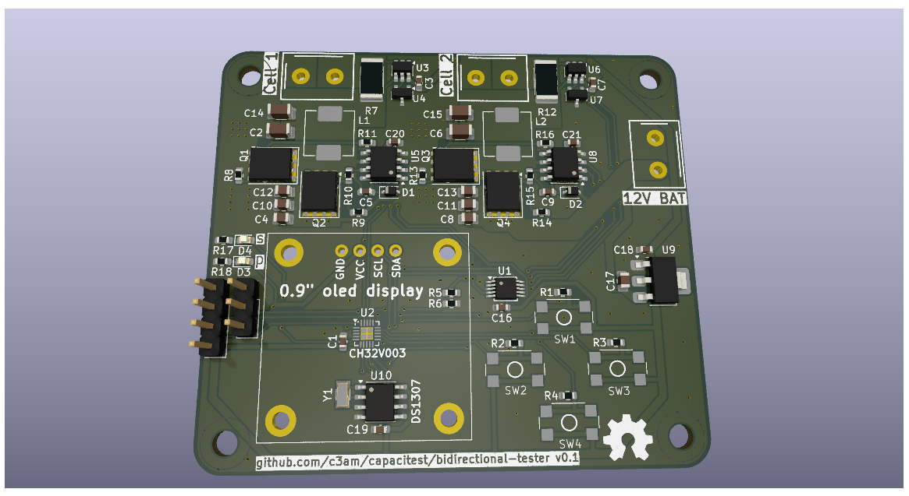

# capacitest
A low cost dual cell battery capacity tester with an oled screen using the ch32v003 microcontroller.

# discharge-tester (old version, unfinished)
In the discharge-tester directory is a pcb with mosfets used as variable resistors for discharging the cells.
It uses LMV358's as current sense amplifiers across 1 Ohm current sense resistors.
I did not get this setup to work, because the built-in adc gave me very jittery values.
Maybe there is something wrong with my circuit, or you just have to software filter the adc values.

# bidirectional-tester (current version, under development)
This is the newer version, which uses bidirectional buck-boost converters for charging the cells from an external ~12V battery/discharging them into that battery.

- ADS 1115 for current and voltage sensing
- ina181a2 + ref2020(2V Vref) for current sense amplification
- ir2101 low+high side mosfet drivers
- ceramic capacitors only
- the two bidirectional buck-/boost-converters each have 1uH SMD inductors, 200uF on the cell and 66uF capacitance on the ~12V battery side
- 0.9" i2c oled screen

## development status/roadmap:
| step                          | status        |
| ----------------------------- | ------------- |
| schematic design              | [done]        |
| PCB design                    | [done]        |
| get PCB and other components  | [...]         |
| assemble board                | [not started] |
| test board/write code         | [not started] |
| if not working, repeat        |               |
| finalize code and put online  | [not started  |

(last updated: 2025-05-08)
